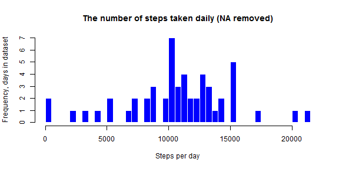
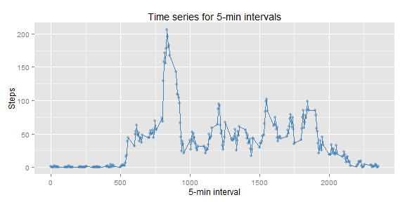
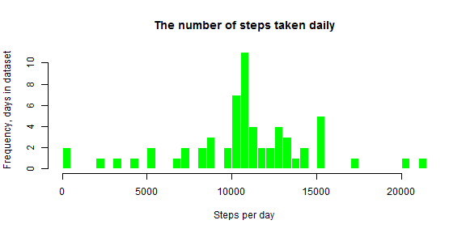
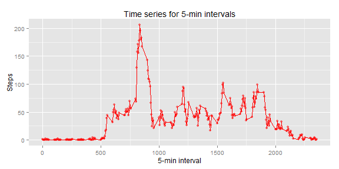
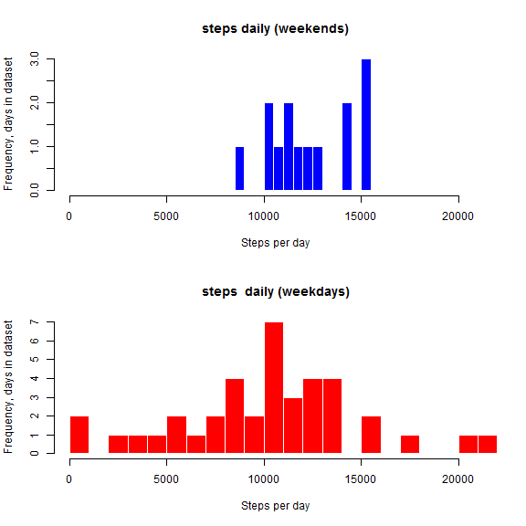
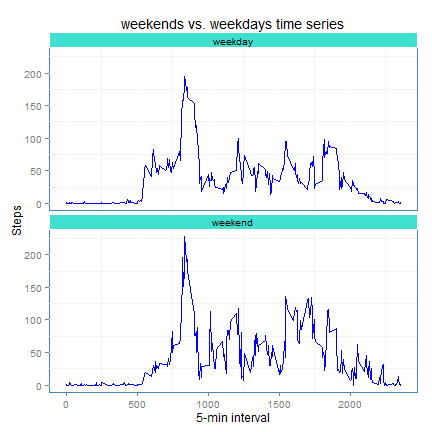
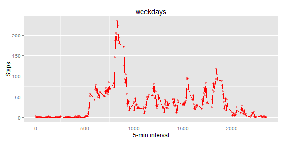

## Background and objectives

This assignment makes use of data from a personal activity monitoring device. This device collects data at 5 minute intervals throughout the day. The data consists of two months of data from an anonymous individual collected during the months of October and November, 2012 and include the number of steps taken in 5 minute intervals each day.

The assigneent includes a number of specific questions which are presented in sections below. 

## Loading and preprocessing the data

The data for this assignment were downloaded from the course web site:

Dataset: Activity monitoring data [activity.csv](https://d396qusza40orc.cloudfront.net/repdata%2Fdata%2Factivity.zip)

The variables included in this dataset are:

*  **steps**: Number of steps taking in a 5-minute interval (missing values are coded as NA)
*  **date**: The date on which the measurement was taken in YYYY-MM-DD format
*  **interval**: Identifier for the 5-minute interval in which measurement was taken


First, I load data from the data file: *"activity.csv"* and remove the rows with missing data **NA**. In addition, I transform the column *date* to Date format. 

The dataset typically has  several rows for the same day, and therefore grouping rows by day is required to calculate the average number of steps per day.


```r
  rm(list=ls())
  mydata=read.csv("activity.csv")

library(dplyr)

# Data transformation and grouping are combined into one command
  mydata_byday<-group_by(mutate(na.omit(mydata), date=as.Date(date)), date)
  mydata_daily<-summarize(mydata_byday, steps_daily=sum(steps))
```

 
## What is mean total number of steps taken per day?

 
Then, we can calculate the mean and the median number of steps per day:


```r
  mean(mydata_daily$steps_daily)
```

```
## [1] 10766.19
```

```r
  median(mydata_daily$steps_daily)
```

```
## [1] 10765
```


**Please note** that mean and the calculations of the mean and median values do not include the days for which there are no records of steps (*steps=0*). In this case the median and the mean are similar, which shows that the distribution of steps per day is not skewed. 

**Histogram (data with NA excluded)**:


```r
hist(mydata_daily$steps_daily, breaks=60, main="The number of steps taken daily (NA removed)", ylab="Frequency, days in dataset", xlab="Steps per day", col="blue", border ="white")
```

 

This diagram shows that there are records (days) for which there are not steps recorded. There are days for which the number of steps is > 20,000. It is estuimated that roughly the number of steps in a mile is 2000, therefore these records correspond to long journeys of more than 10 miles.  


## What is the average daily activity pattern?

The pattern of daily activity can be explored by drawing a time series plot of the 5-minute interval (x-axis) and the average number of steps taken, averaged across all days (y-axis)


```r
# Groupin data  / in ddplyr / 
mydata_byinterval <-group_by(na.omit(mydata), interval)
library(ggplot2)
  
data4timeseries<-summarize(mydata_byinterval, steps=mean(steps))
  
  ggplot(data4timeseries, aes(x=interval, y=steps))+geom_line() + labs(x="5-min interval", y="Steps" ) + geom_point(color="steelblue", alpha = 1/2) + geom_line(colour = "steelblue", size = 1/3) + labs(title="Time series for 5-min intervals")
```

 

Further, the maximum number of steps within a 5-minutes interval averaged across days is: 


```r
round(max(data4timeseries$steps),1)
```

```
## [1] 206.2
```

The time interval corresponding to this value: 


```r
maxstepsinterval<-filter(data4timeseries, steps==max(data4timeseries$steps))
maxstepsinterval$interval
```

```
## [1] 835
```

## Imputing missing values


The presence of missing days (values = **NA**) may introduce bias into some calculations or summaries of the data.
The total number of rows with missing data: 


In order to impute the missing deta, the following approach was taken:

The value of steps for a given row in a dataset will be assumed to be equal to the average across all days corresponding to the interval for which the data alement is missing, as described in steps below: 

1. Create an NA-free dataset 
2. Create a dataset by selectung rows with missing data 
3. Merge data in the dataset with missing data with the dataset with the averages steps
4. Replace the missing data with the averages for specific interval 
5. Harmonize the column names
6. Merge datasets into an NA-free dataset 


```r
# NA free subset  
  mydata_no_NA <- filter(mydata, !is.na(steps))  
# subest with NA
  mydata_NA <- filter(mydata, is.na(steps))
# merge subset with missing data with the subset containing averages 
  mydata_NA_merged<-merge(mydata_NA, data4timeseries, by = "interval") 
# fill the missing data (steps.x) with the averages for similar intevals (steps.c) 
  mydata_NA<-mutate(mydata_NA_merged, steps.x=steps.y) 
# Select only columns needed to combine with the NA free subset
  mydata_NA<-select((mutate(mydata_NA, steps=steps.x)), interval, date, steps) 
# Combine the subset into the new dataset with missing data imputed  
  mydata_new<-rbind(mydata_no_NA, mydata_NA) 
```

#### Reanalyzing the dataset with missing data imputed 

Calculating the new mean and median: 


```r
## Data transformation and grouping are combined into one command

mydata_byday <-group_by(mutate(mydata_new, date=as.Date(date)), date)
mydata_daily<-summarize(mydata_byday, steps_daily=sum(steps))

# Mean
mean(mydata_daily$steps_daily)
```

```
## [1] 10766.19
```

```r
# Median 
median(mydata_daily$steps_daily)
```

```
## [1] 10766.19
```

Interstingly, the new mean and median ar not different within the 2 decimal point precision. Not surprisingly, we do not see differences in the shapes of the histograms.  

#### Histogram:


```r
hist(mydata_daily$steps_daily, breaks=60, main="The number of steps taken daily", ylab="Frequency, days in dataset", xlab="Steps per day", col="green", border ="white")
```

 

Further, we repeat the time series analysis. 

#### Time series


```r
mydata_byinterval <-group_by(mydata_new, interval)

library(ggplot2)

data4timeseries<-summarize(mydata_byinterval, steps=mean(steps))
ggplot(data4timeseries, aes(x=interval, y=steps))+geom_line() + labs(x="5-min interval", y="Steps" ) + geom_point(color="red", alpha = 1/2) + geom_line(colour = "red", size = 1/3) + labs(title="Time series for 5-min intervals")
```

 


## Are there differences in activity patterns between weekdays and weekends?
This analysis is conducted by adding days of week to the dataset and creating two subsets for weekends (Saturdays and Sundays, which is common for the wester world but may be different in som other countries) and weekdays.  


```r
# Use data with NA omitted
  
  mydata_byday <-group_by(mutate(na.omit(mydata), date=as.Date(date)), date)
  # This dataset include activity summarized for each day 
  mydata_daily<-summarize(mydata_byday, steps_daily=sum(steps))
  
# Add a column with days of week 
  mydata_daily <- mutate( mydata_daily, dow=weekdays(as.Date(mydata_daily$date)))
  
# Add a factor dichotomous column 
  mydata_daily <- mutate( mydata_daily, whatday=factor((dow=="Saturday" | dow=="Sunday")*1, labels=c("weekday", "weekend")))

# Subsetting into weekdays and weekends data 
mydata_weekends <-filter(mydata_daily, as.character(mydata_daily$whatday)=="weekend")
mydata_weekdays <-filter(mydata_daily, as.character(mydata_daily$whatday)=="weekday")  
```

These datasets can be presented as **histograms** as well as time **series*. For the purpose of visual comparisons the two histograms are presented in one chart: 


```r
# Create space for parted diagrams  
par(mfrow=c(2,1))

# Set the same x-range for both hiztograms  
xrange<-range(c( min(mydata_daily$steps_daily), max(mydata_daily$steps_daily)))

# Histogram 1

hist(mydata_weekends$steps_daily, breaks=20, main="steps daily (weekends)", ylab="Frequency, days in dataset", xlim=xrange, xlab="Steps per day", col="blue", border ="white")

# Histogram 2

hist(mydata_weekdays$steps_daily, breaks=20, main="steps  daily (weekdays)", ylab="Frequency, days in dataset", xlim=xrange, xlab="Steps per day", col="red", border ="white")
```

 

The above exploratory analysis of frequence of steps per day suggets rather different patterns. This individual seems to have variable walking patterns over the working week, ceneterd around ~10,000 steps per day, short walks and long walks can also be seen in teh data.

The pattern over weekends are less variable: no weekends with low walking activities, the number of steps per day is generally in the range of 10-15 thousand steps per day. 

Let us explore within-day behaviour by looking at the **time series**. To conduct this analysis we will prepare two datasets of data grouped by interval, sing the same algorithm as for the time series analysis above. **Note** that in this analysis we exclude rows with missing data as we do not expect the missing data to skew the conclusions. 

Firstly, we prepare datasets: 


```r
# Grouping data  / in ddplyr / 

  mydata_byinterval <-group_by(na.omit(mydata), interval)

# Adding days of week 

mydata_byinterval <- mutate( mydata_byinterval, dow=weekdays(as.Date(mydata_daily$date)))
mydata_byinterval <- mutate( mydata_byinterval, whatday=factor((dow=="Saturday" | dow=="Sunday")*1, labels=c("weekday", "weekend")))

  mydata_weekends <-filter(mydata_byinterval, whatday=="weekend")
  mydata_weekdays <-filter(mydata_byinterval, whatday=="weekday")

    data4timeseries_weekends<-summarize(mydata_weekends, steps=mean(steps))
    data4timeseries_weekdays<-summarize(mydata_weekdays, steps=mean(steps))
```


Similarly to the analysis above, the weekend and weekdays datasets are presented for the same x-range: 


```r
# Create space for parted diagrams  

ggplot(data4timeseries_weekends, aes(x=interval, y=steps))+geom_line() + labs(x="5-min interval", y="Steps" ) + geom_point(color="blue", alpha = 1/2) + geom_line(colour = "blue", size = 1/3) + labs(title="weekends")
```

 

```r
ggplot(data4timeseries_weekdays, aes(x=interval, y=steps))+geom_line() + labs(x="5-min interval", y="Steps" ) + geom_point(color="red", alpha = 1/2) + geom_line(colour = "red", size = 1/3) + labs(title="weekdays")
```

 

The time seies analysis suggests some differences in wakling patterms. The weekends data indicate an aerly start of activities.On weekdays, there is stronger peak around intervals ~800. Then the walking activiti stabilizes, and remains almost constant until the end of a week day. The patterms for weekends indicate high walking activity throughout the day, that ends later than on weekdays. 

These patterns suggest that this indicidual is probably working.  


## Summary and discussion   

In summary this simple exploratory analysis suggests: 

* This individual is rather active, with the number of steps taken daily exceeding >10K 
* The average pattern within a day suggests possibly early start with an activity peak around interval 800 and lower and stable patterns of walking for the rest of the day 
* The impact of missing data on results is rather low and in this reseacrh we did not need to worry about it 
* The difference in walking patterns during weekends and working days is considerable; in the  initial analysis these two distinch behavious were blended with the weekdays patterns dominating   

** Limitations of the study **

1. This is a descriptive study with no hypothesis formulatet  
2. This is only one individual who has no other characteristics (age range,  gender ot others), we can probably say that this person is from a country where weekdays are from Monday to Friday.    


It is **amazing** how much an exploratory analysis of data that can or is be collected via modern mobile devices these days. This simple analysis of walking patterns of one anonymous individual shows the power and the potential richness of data collected these days routinely and the potential analytics and meaningful analyses that can be conducted.  

The areas of applications is wide, and can include health, commuting, customer behavior, security. The power of such analyis can increase astronomically if combined with other data, such as shopping activities or any card transactions. Further such data can be analysed across different individuals and grousp and identify correlation or potential social network connections. To ms this looks **SCARY**.   

