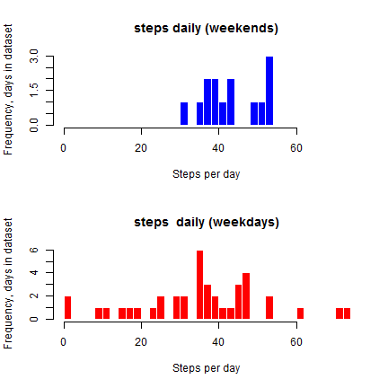

## Background and objectives

This assignment makes use of data from a personal activity monitoring device. This device collects data at 5 minute intervals throughout the day. The data consists of two months of data from an anonymous individual collected during the months of October and November, 2012 and include the number of steps taken in 5 minute intervals each day.

The assignment includes a number of specific questions which are presented in sections below. 

## Loading and pre-processing the data

The data for this assignment were downloaded from the course web site:

Dataset: Activity monitoring data [activity.csv](https://d396qusza40orc.cloudfront.net/repdata%2Fdata%2Factivity.zip)

The variables included in this dataset are:

*  **steps**: Number of steps taking in a 5-minute interval (missing values are coded as NA)
*  **date**: The date on which the measurement was taken in YYYY-MM-DD format
*  **interval**: Identifier for the 5-minute interval in which measurement was taken


First, we load raw data from the data file: *“activity.csv”* and remove the rows with missing data **NA** (the initial analysis was conducted with NA ignored).  The column date to was transformed to Date format.  The dataset has many rows foreach  day, and therefore grouping rows by day is required to calculate the number of steps taken daily. R-package *dplyr* was used for data transformation and filtering, as shown below.


```r
  rm(list=ls())
  mydata=read.csv("activity.csv")

library(dplyr)

# Data transformation and grouping are combined into one command
  mydata_byday<-group_by(mutate(na.omit(mydata), date=as.Date(date)), date)
  # mydata_daily<-summarize(mydata_byday, steps_daily=sum(steps))
  
  mydata_daily<-summarize(mydata_byday, steps_daily=sum(steps))
```

**Note**: *on my system, opening dplyr library generates  warning messages, visible above.* 
 
## What is mean total number of steps taken per day?

From the transformed data, we can calculate the mean and the median number of steps per day:


```r
  mean(mydata_daily$steps_daily)
```

```
## [1] 10766.19
```

```r
  median(mydata_daily$steps_daily)
```

```
## [1] 10765
```


**Please note** that mean and the calculations of the mean and median values do not include the days for which there are no records of steps (*steps=0*). In this case the median and the mean are similar, which shows that the distribution of steps per day is not skewed. 

**Please note**:  the calculations of the mean and median values do not include the days for which there are no records of steps (*steps=0*).  In this analysis the median and the mean values are similar, which suggests that the distribution of steps per day is not skewed. 

Subsequently, we build a histogram (frequency analysis):


**Histogram (data with NA excluded)**:


```r
hist(mydata_daily$steps_daily, breaks=60, main="The number of steps taken daily (NA removed)", ylab="Frequency, days in dataset", xlab="Steps per day", col="blue", border ="white")
```

 


This diagram shows  a wide range of steps per day, from low walking activity to some days for which the number of steps is > 20,000. (It can be assumed that roughly2000. [link](http://www.thewalkingsite.com/10000steps.html), therefore these records correspond to long journeys of more than 10 miles.)  


## What is the average daily activity pattern?

The pattern of daily activity can be explored by plotting time series of the 5-minute interval (on x-axis) and the average number of steps taken, averaged across all days (on y-axis).


```r
# Grouping data  / in ddplyr / 
mydata_byinterval <-group_by(na.omit(mydata), interval)
library(ggplot2)
  
data4timeseries<-summarize(mydata_byinterval, steps=mean(steps))
  
ggplot(data4timeseries, aes(x=interval, y=steps))+geom_line() + labs(x="5-min interval", y="Steps" ) + geom_point(color="steelblue", alpha = 1/2) + geom_line(colour = "steelblue", size = 1/3) + labs(title="Time series for 5-min intervals")
```

 

Further, the maximum number of steps within a 5-minutes interval averaged across days is: 


```r
round(max(data4timeseries$steps),1)
```

```
## [1] 206.2
```

This corresponds to one step to 1.5 second. The time interval corresponding to this value:


```r
maxstepsinterval<-filter(data4timeseries, steps==max(data4timeseries$steps))
maxstepsinterval$interval
```

```
## [1] 835
```

## Imputing missing values


The presence of missing days (values = **NA**) may introduce bias into some calculations or summaries of the data.  In order to impute values for the rows with missing data, the following approach was taken:

The value of steps for a given row in a dataset was assumed to be equal to the average across all days corresponding to the interval for which the data element is missing, as described in steps below:


1.	Created an NA-free dataset
2.	Created a dataset by selecting rows with missing data
3.	Merged data in the dataset with missing data, with the dataset with the averages steps
4.	Replaced the missing data with the averages for specific interval
5.	Merged the datasets into an NA-free dataset
 


```r
# NA free subset  
  mydata_no_NA <- filter(mydata, !is.na(steps))  
# subest with NA
  mydata_NA <- filter(mydata, is.na(steps))
# merge subset with missing data with the subset containing averages 
  mydata_NA_merged<-merge(mydata_NA, data4timeseries, by = "interval") 
# fill the missing data (steps.x) with the averages for similar intevals (steps.c) 
  mydata_NA<-mutate(mydata_NA_merged, steps.x=steps.y) 
# Select only columns needed to combine with the NA free subset
  mydata_NA<-select((mutate(mydata_NA, steps=steps.x)), interval, date, steps) 
# Combine the subset into the new dataset with missing data imputed  
  mydata_new<-rbind(mydata_no_NA, mydata_NA) 
```

#### Reanalyzing the dataset with missing data imputed 

Calculating the new mean and median: 


```r
## Data transformation and grouping are combined into one command

mydata_byday <-group_by(mutate(mydata_new, date=as.Date(date)), date)
mydata_daily<-summarize(mydata_byday, steps_daily=sum(steps))

## mydata_daily<-summarize(mydata_byday, steps_daily=mean(steps))

# Mean
mean(mydata_daily$steps_daily)
```

```
## [1] 10766.19
```

```r
# Median 
median(mydata_daily$steps_daily)
```

```
## [1] 10766.19
```

Interestingly, the new mean and median ar not different within the 2 decimal point precision. Not surprisingly, we do not see differences in the shapes of the histograms.


#### Histogram (imputed vaues where data elements are missed):


```r
hist(mydata_daily$steps_daily, breaks=60, main="The number of steps taken daily", ylab="Frequency, days in dataset", xlab="Steps per day", col="green", border ="white")
```

 

Further, we repeat the time series analysis. 

#### Time series (imputed vaues where data elements are missed):


```r
mydata_byinterval <-group_by(mydata_new, interval)

library(ggplot2)

data4timeseries<-summarize(mydata_byinterval, steps=mean(steps))
ggplot(data4timeseries, aes(x=interval, y=steps))+geom_line() + labs(x="5-min interval", y="Steps" ) + geom_point(color="red", alpha = 1/2) + geom_line(colour = "red", size = 1/3) + labs(title="Time series for 5-min intervals")
```

 


## Are there differences in activity patterns between weekdays and weekends?

This analysis is conducted by adding days of week to the dataset and creating two subsets for weekends (Saturdays and Sundays, which is common for the wester world but may be different in some other countries) and weekdays.  


```r
# Use data with NA omitted
  
  mydata_byday <-group_by(mutate(na.omit(mydata), date=as.Date(date)), date)
  # This dataset include activity summarized for each day 
  ## mydata_daily<-summarize(mydata_byday, steps_daily=sum(steps))
  
mydata_daily<-summarize(mydata_byday, steps_daily=mean(steps))
  
# Add a column with days of week 
  mydata_daily <- mutate( mydata_daily, dow=weekdays(as.Date(mydata_daily$date)))
  
# Add a factor dichotomous column 
  mydata_daily <- mutate( mydata_daily, whatday=factor((dow=="Saturday" | dow=="Sunday")*1, labels=c("weekday", "weekend")))

# Subsetting into weekdays and weekends data 
mydata_weekends <-filter(mydata_daily, as.character(mydata_daily$whatday)=="weekend")
mydata_weekdays <-filter(mydata_daily, as.character(mydata_daily$whatday)=="weekday")  
```

These datasets can be presented as **histograms** as well as time **series**. For the purpose of visual comparisons the two histograms are presented in one chart: 


```r
# Create space for parted diagrams  
par(mfrow=c(2,1))

# Set the same x-range for both hiztograms  
xrange<-range(c( min(mydata_daily$steps_daily), max(mydata_daily$steps_daily)))

# Histogram 1

hist(mydata_weekends$steps_daily, breaks=14, main="steps daily (weekends)", ylab="Frequency, days in dataset", xlim=xrange, xlab="Steps per day", col="blue", border ="white")

# Histogram 2

hist(mydata_weekdays$steps_daily, breaks=40, main="steps  daily (weekdays)", ylab="Frequency, days in dataset", xlim=xrange, xlab="Steps per day", col="red", border ="white")
```

 


The above exploratory analysis of frequency of steps per day suggest rather different patterns. This individual seems to have variable walking patterns over the working week, centred around ~10,000 steps per day, short walks and long walks can also be seen in the data.

The patterns over weekends are less variable: no weekends with low walking activities, the number of steps per day is generally in the range of 10-15 thousand steps per day.


Let us explore within-day behaviour by looking at the **time series**. To conduct this analysis we will prepare two datasets of data grouped by interval, sing the same algorithm as for the time series analysis above. 

**Note** that in this analysis we exclude rows with missing data as we do not expect the missing data to skew the conclusions. 

Firstly, we prepare datasets: 


```r
# Development 
     
mydata_new<-mutate(mydata_new, dow=weekdays(as.Date(mydata$date)))

mydata_new <- mutate( mydata_new, whatday=factor((dow=="Saturday" | dow=="Sunday")*1, labels=c("weekday", "weekend"))) 
mydata_byinterval <-group_by(mydata_new, whatday, interval) 
data4timeseries_all<-summarize(mydata_byinterval, steps=mean(steps)) 
```


Similarly to the analysis above, the weekend and weekdays datasets are presented for the same x-range: 


```r
library(ggplot2)


ggplot(data4timeseries_all, aes(x=interval, y=steps))+geom_line() + labs(x="5-min interval", y="Steps" )   +facet_wrap(~whatday, ncol=1)+ geom_line(colour = "blue", size =0.6) + labs(title="weekends vs. weekdays time series") + theme(panel.background = element_rect(fill = 'white', colour = 'steelblue')) + theme(strip.background=element_rect(fill='turquoise', colour='white')) 
```

 

The time series analysis suggests some differences in walking patterns. The weekends' data indicate an early start of activities. On weekdays, there is stronger peak around intervals ~800. Then the walking activity stabilizes, and remains almost constant until the end of a week day. The patterns for weekends indicate high walking activity throughout the day that ends later than on weekdays.

These patterns suggest that this individual is probably a working person.  


## Summary and discussion   

In summary this simple exploratory analysis suggests: 

* This individual is rather active, with the number of steps taken daily exceeding >10K on  some days 
* The average pattern within a day suggests possibly early start with an activity peak around interval >800, and the lower and stable pattern of walking for the rest of the day 
* The impact of missing data on results is rather low  
* The difference in walking patterns during weekends and the weekdays is considerable; in the  initial analysis these two distinct patterns were blended, with the weekdays' patterns dominating   

**Limitations of the study**

1. This is a descriptive study with no hypothesis formulated  
2. This is only one individual who has no other characteristics (age range,  gender ot others), we can probably say that this person is from a country where weekdays are from Monday to Friday.
3. The R-code is rather narrative, some sections use repeated calculations and the code can be made more compact by using functions 

**Discussion**

It is **amazing** how much interpretable data is being collected via modern mobile devices these days. The simple analysis in the Reproducibe Rsesearch Assignment of the walking patterns of an  anonymous individual shows the power and the potential richness of data collected routinely and the potential meaningful analyses that can be conducted.  

The areas of applications is wide, and can include health, commuting, customer behavior and marketing, security, intelligence. The power of analyis of data colleted from wearables increases astronomically if combined with other data, such as shopping activities or any other card transactions. Further, such data can be analysed across different individuals and groups and identify correlation or potential social connections. 


To me this looks **SCARY**.  


Completed on : **June 14, 2015**  

